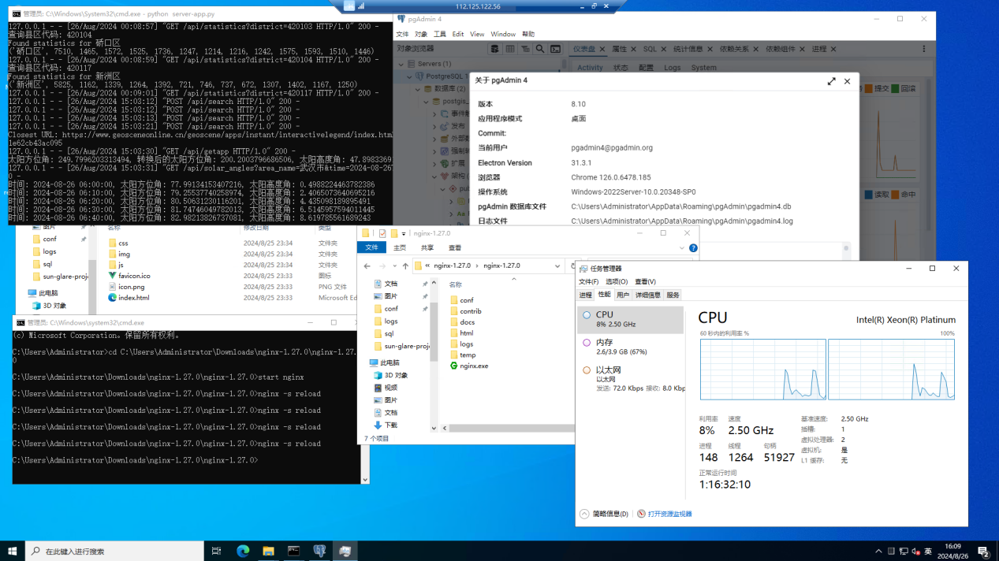
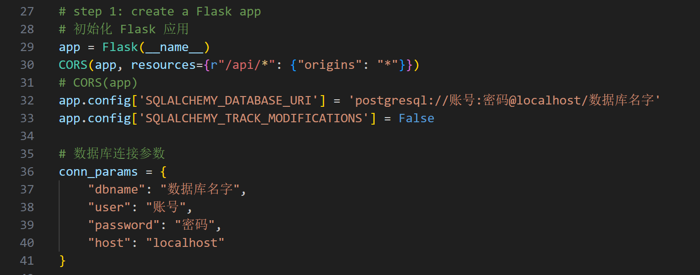
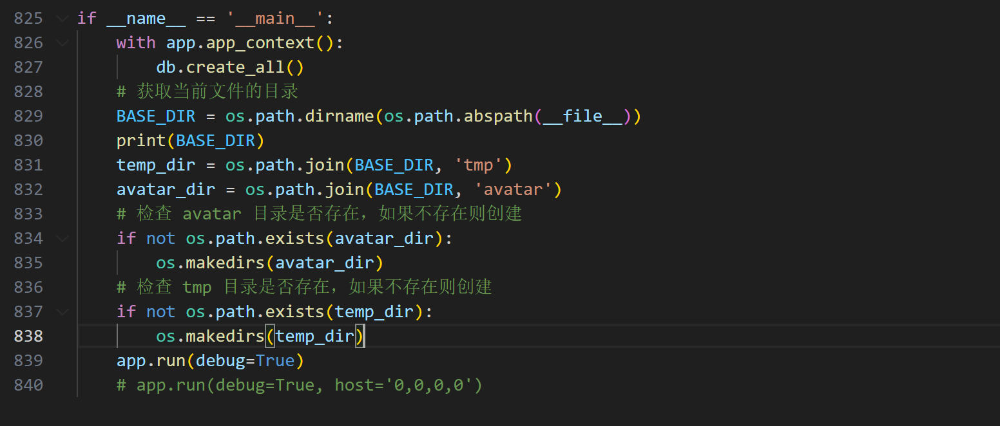
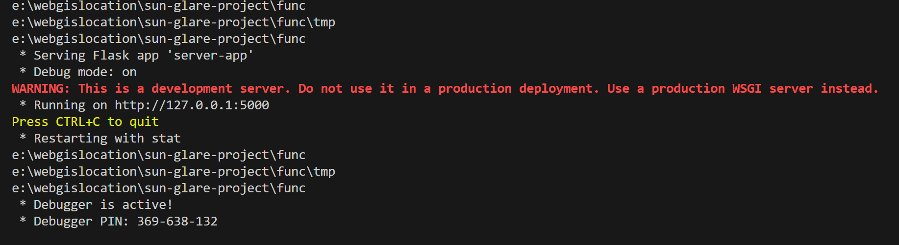
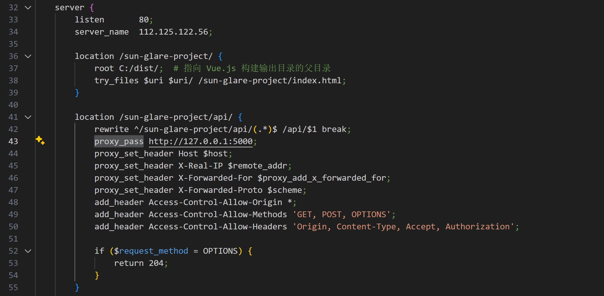

# “阳光智途，朝夕畅行”——面向行车安全的太阳眩光感知及路径优化系统 🌞🚗

## 1. 在线访问地址 🌐

------

在线访问地址分为网页地址和仓库地址。

### 1.1 项目网页地址 🌍

[项目阿里云网页地址](http://112.125.122.56/sun-glare-project/lu-jing-gui-hua) (目前阿里云端服务器已经停止维护) 🚫

[项目GitHub.io网页地址](https://yihanchangbanqingchun.github.io/sunglare-with-vue3/)(2024/12/29 更新，但是本地后端用ngrok代理到公网运行效果不好，因为是免费版，再测试一下) 🌍

### 1.2 项目仓库地址 📦

[项目仓库地址](https://github.com/YiHanChangBanQingChun/sunglare-with-vue3/tree/gis-class-dev) 🗃️

### 1.3 备注 📝

由于服务器内存大小限制，目前无法开放所有日期的路径规划，仅开放9月份的部分天数（4天一间隔）可以查询，9月其他日期靠匹配最近日期实现。并且由于阿里云免费服务器的限制，目前暂定是10月8日自动清除实例，届时可能无法访问网页。 🗓️

服务器已经停止维护（2024-10-8） 🚫

## 2. 安装部署说明文档 🛠️

------

安装部署分为生产环境部署、开发环境部署与数据处理环境部署。

### 2.1 生产环境部署 🏭

#### 2.1.1 软件硬件需求 💻

目前测试成功的服务器环境是使用的 CPU 和内存是 Intel® Xeon® Platinum 可扩展处理器 2 核 (vCPU) 4 GiB 的阿里云云服务器 ECS 实例，40g 硬盘大小。系统使用的是 Windows Server 2022 数据中心版 64 位中文版。后端使用的是安装 `requirements.txt`（Python 扩展包安装文件）后的 Python 3.11.4 后端环境。代理使用的是 Nginx 1.27.0。数据库使用 PostgreSQL 16 版本及对应的 Postgis x86 版本。 🖥️

 🌐

需要安装 Nginx、PostgreSQL 及对应版本 Postgis、Python 3.11.4 以及 `requirements.txt` 对应文件。需要启动 Postgis 和 Pgrouting 插件。 🗄️

#### 2.1.2 后端程序部署 🖥️

1. 打开 `...\initialization`，解压 `sql.zip` 文件。 📂
2. 使用 cmd，创建基于 Python 3.11.4 的虚拟环境，可以使用 pip 或者 conda 激活或创建。例如，pip 是盛怒如 `python -m venv flask-py11` 创建环境，输入 `.\venv\Scripts\activate` 是激活环境。 🐍
3. 然后在 cmd 激活环境后，在 `...\initialization`，键入 `pip install -r requirements.txt`，下载扩展包，如果遇到卡顿，可以使用清华镜像源进行安装，键入 `pip install -r requirements.txt -i https://pypi.tuna.tsinghua.edu.cn/simple` 即可。 📦
4. 安装完后端及自动部署数据库所需的扩展包后，在 cmd 中键入 `python setup.py`，输入相关的 PostgreSQL 信息即可自动化完成配置。这一步骤会在数据库中创建以及复制武汉市的 POI 信息、带太阳眩光信息与否的路网数据、用户数据。注意，如果内存较大，可以在运行 `python setup.py` 前将 `sql_road_date_time_extension.zip`，将全部文件并入 `sql.zip` 的 `road_date_time` 文件夹。 🗺️
5. 修改 `...\initialization\server-app.py`，需要将 32 行，36 到 41 行修改为你安装位置的数据库信息和账号密码，将第 839 行注释掉，将第 840 行取消注释。 🔧

 🖼️

1. 在位于安装文件夹和激活环境的 cmd 输入 `python server-app.py`，如果看见类似于以下提示，则表明后端 flask 正确启动。 🚀

 🖥️

1. 之后修改 `...\initialization\nginx.conf`，第 33 行的 `listen` 后面数字修改为电脑需要监听的端口，第 34 行 `server_name` 修改为公网 IP（IPv4），第 37 行 `root` 修改为 `.../initialization/dist`（需要使用完整路径），第 43 行 `proxy_pass` 修改为你的 flask 运行端口（通常是默认，无需修改）。修改完后打开 nginx 安装路径的文件夹，进一步打开，将刚刚修改的 nginx 文件复制进去，替换旧文件。然后进入 nginx 安装文件夹路径的 cmd，输入 `start nginx`，如果没有报错，即可完成启动，如果你需要在启动时应用修改 nginx 内的文件，需要输入 `nginx -s reload`，如果需要终止进程，需要输入 `nginx -s stop`。 🌐

 🖼️

#### 2.1.3 前端程序部署 🌐

由于公网 IP 需要个人修改，所以生产环境需要微调开发源代码。 🛠️

1. 需要安装 node.js 环境，在 `...\initialization` 文件夹中，找到 `.env.production` 文件，修改 `VUE_APP_API_URL` 的值为 `http://你的公网ip/sun-glare-project`。 🌍
2. 然后在 `...\initialization` 这一路径 cmd 运行 `npm install`，再运行 `npm run build`，此时，在 `...\C913\initialization` 文件夹找到 `dist` 文件夹，在里面创建文件夹，名为 `sun-glare-project`，将 `dist` 文件夹其他东西剪贴进去。 📦
3. 最后返回开发源代码文件夹，将 `dist` 复制到 `...\initialization` 路径。 📂

此时，就可以浏览：<http://您的公网ip/sun-glare-project/lu-jing-gui-hua> 。 🌐

### 2.2 开发环境部署 🛠️

#### 2.2.1 软件硬件需求 💻

笔者使用的是 Windows 11 家庭版，CPU 是 Intel i5 12500h，内存是 16G，预留了约 150g 以上空间。测试软件版本是 node.js 是 v21.7，Python 3.11.4，数据库使用 PostgreSQL 16 版本及对应的 Postgis x86 版本。 🖥️

#### 2.2.2 后端程序部署 🖥️

1. 与生产环境部署的后端程序部署的 2.1.2.1 到 2.1.2.4 步骤相同。 🔧
2. 修改 `...\initialization\server-app.py`，需要将 32 行，36 到 41 行修改为您安装位置的数据库信息和账号密码。 🔐
3. 与生产环境部署的后端程序部署的 2.1.2.6 步骤相同。 🚀

#### 2.2.3 前端程序部署 🌐

1. 在 `...\initialization` 这一路径 cmd 运行 `npm install`，安装项目所需要的扩展。 📦
2. 然后运行 `npm run serve` 即可根据提示本地访问网页：<http://localhost:8080/sun-glare-project/lu-jing-gui-hua> 。 🌍

 🖼️

1. 如果需要修改，则需要保存修改后运行 `npm run build`，此时会生成新的 `dist` 文件夹，重复 2.2.3.1 和 2.2.3.2 即可。 🔄

### 2.3 数据处理环境部署 🗄️

数据处理环境部署分为深度学习环境部署与地理处理环境部署。两者对于扩展包的版本要求不严格，并且需要根据实际情况调整，所以不提供 `requirement.txt` 文件进行便捷安装。 📂

#### 2.3.1 深度学习环境部署 🧠

需要安装 MXNet 对应的 CUDA 版本，30 系以下可以在 Windows 环境部署 MXNet 的 CPU、GPU 版本的扩展包，推荐使用的是 Python 3.8 版本。更低的 CUDA 版本可以使用更低的 Python 版本。30 系以上显卡测试无法在 Windows 环境部署 MXNet 的 GPU 版本，仅可运行 CPU 版本。所以 30 系以上建议使用 Linux 系统进行深度学习环境配置。笔者使用的是 Ubuntu 18.4 系统，RTX 3090 显卡，CUDA 11.2 显卡版本，安装相应的扩展包，即可运行 `...\initialization\数据处理环境\segrepano-gpu-deeplabv3-resnet101-citys.py`。 🖥️

#### 2.3.2 地理数据处理环境部署 🌐

笔者使用相同的 Python 3.8 版本进行运行，这一环境部署对系统不做限制。正确安装后即可运行 `...\initialization\数据处理环境\workflow.py` 文件，需要灵活使用批注来进行函数调用，以生成符合要求的文件进行后续处理。 🗺️

## 3.联系我们 📞

------

### 如果您有任何问题或建议，或者遇到了漏洞，请联系我们

- **项目单位**：广州大学地理科学与遥感学院 🏫
- **项目 GitHub 地址**：[sun-glare-with-vue3](https://github.com/YiHanChangBanQingChun/sunglare-with-vue3) 🌐
- **贡献者**：[YiHanChangBanQingChun](https://github.com/YiHanChangBanQingChun) 👤、[5769812](https://github.com/5769812) 👤、[lxf-731](https://github.com/lxf-731) 👤
- **邮箱**：<yihanchangbanqingchun@gmail.com> ✉️

------
